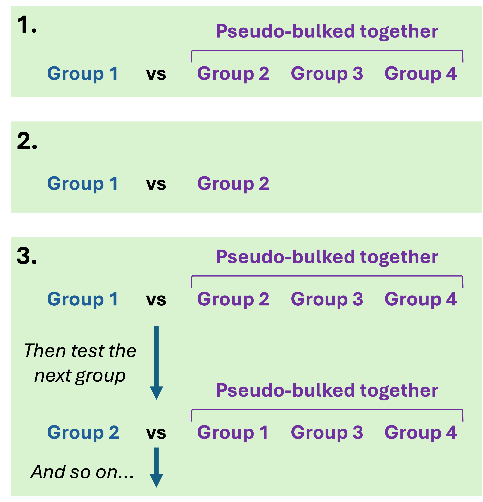

```{r, include = FALSE}
knitr::opts_chunk$set(
  collapse = TRUE,
  comment = "#>"
)
```

```{r, eval = FALSE, include = FALSE}
library(isopod)
```

\

# Overview

isopod is an R package that attempts to find transcripts exhibiting differential transcript usage (DTU) in groups of cells from a single-cell dataset. It requires two main data inputs:

-   An isoform-level counts table as a dataframe, with isoform names, gene names, and counts data.
-   A dataframe that specifies which group each cell belongs to.

Provided these inputs, isopod first filters the counts table to exclude low count or sparsely represented genes. In addition, low-count isoform counts are collapsed (but not removed) into an artificial isoform on a per-gene basis, allowing us to remove from analysis isoforms resulting from noisy read assignment, while retaining their counts data for gene-level calculations required by other isoforms in the gene.

The filtered dataset is then passed to a permutation analysis, which finds transcripts exhibiting DTU between the specified cell group against the rest of the dataset, in a one-vs-all fashion. If you want to compare two specific cell groups, or to run each cell group against the rest of the dataset automatically, check both [2. get_permutation_pvals] and the function documentation at `get_permutation_pvals()`.

The final output from the pipeline is a list containing different dataframes, one of which is information on whether isoforms exhibit DTU in a cell group.

<br>

------------------------------------------------------------------------

<br>

# A quickstart guide to running isopod

First install isopod from the development Github and load it using:

```{r eval=FALSE}
remotes::install_github('michael-nakai/isopod')
library(isopod)
```

To run isopod, we need two dataframes:

-   An isoform-level counts table with isoform and gene names
-   A dataframe that ties each cell to a cell group.

Here's an example of what the tables might look like:

```{r}
counts_table <- data.frame('transcript_id' = c('transcript1', 'transcript2', 'transcript3', 'transcript4', 'transcript5'),
                           'gene_id' = c('gene1', 'gene1', 'gene1', 'gene2', 'gene2'),
                           'cell_1' = c(5, 2, 0, 10, 5),
                           'cell_2' = c(5, 2, 0, 10, 5),
                           'cell_3' = c(0, 2, 5, 5, 10),
                           'cell_4' = c(0, 2, 5, 5, 10))
cell_groups <- data.frame('cell_id' = c('cell_1', 'cell_2', 'cell_3', 'cell_4'),
                          'cell_group' = c('group_1', 'group_1', 'group_2', 'group_2'))

counts_table

cell_groups
```

To quickly run the pipeline and get the results of the permutation analysis, we can run the following:

```{r eval=FALSE}
permutation_results <- run_everything(counts_table, 
                                      cell_groups, 
                                      transcript_id_colname = 'transcript_id', 
                                      gene_id_colname = 'gene_id',
                                      cell_labels_colname = 'cell_group', 
                                      cell_group_to_analyse = 'group_1', 
                                      output_folder = 'permutation_results')
```

The permutation analysis is computationally expensive, and may take some time depending on the size of your dataset and the computational power availble to you. Luckily, it's also multithreaded, and will try to use all available cores (except for one) on your computer or cluster to speed up the permutations. This means that it can take anywhere from 5 minutes (for a small dataset) to a few hours (for a large dataset with moderate compute power). It's probably best to check the ETA listed on the progress bar and have a coffee or dinner while isopod runs.

## Outputs

`run_everything()` creates a few files containing the permutation results in the output folder. These files can be read back into R with `readRDS()`, and are:

-   `filtered_counts_table.rds` - A list containing the counts table after the filtering step, and a list of collapsed isoforms for each gene. See [1. filter_counts_table].
-   `permutation_results.rds` - A list of all results from the DTU permutation analysis.

<br>

The permutation results object contains a few items. The main outputs are:

-   `permutation_pvalues` - The isoform-level permutation *p*-values for the group specified. Isoforms exhibiting DTU between the group and all other cells will be significant.

-   `permutation_pvalues_gene` - The gene-level permutation *p*-values for the group. This tests whether any change between the group and all other groups can be seen for each gene. Put simply, this tests whether any isoform proportions are significantly changing within the gene, between the specified group and all other cells.

-   `unadjusted_permutation_pvalues` and `unadjusted_permutation_pvalues_gene`, which contain the raw *p*-values at the isoform and gene-level.

-   `genes_filtered_from_cutoff` - A list of genes filtered during the permutation analysis. See [Permutation analysis] for more information on the cutoff.

You're probably looking for `permutation_pvalues` and `permutation_pvalues_gene`, which gives you the permutation *p*-values at the isoform and gene-level. These *p*-values have been corrected using the Benjamini-Hochberg adjustment method. If you'd like raw *p*-values instead to correct at your leisure, look at `unadjusted_permutation_pvalues` and `unadjusted_permutation_pvalues_gene` instead.

<br>

------------------------------------------------------------------------

<br>

# Running individual functions

Running each function lets you access additional options for each, such as running **all** groups at once instead of one at a time. Each function invoked in `run_everything()` is listed below, with explanations of all additonal options.

<br>

## 1. filter_counts_table

-   `gene_count_threshold` : A gene-level filtering step. If the gene counts (found by taking the sum of all transcripts in a gene) are below this number, the transcripts associated with the gene will be filtered out of the table.

-   `autofiltering` : A gene-level filtering step that can be set to `TRUE` or `FALSE`. Removes genes where at least N cells per group do not contain counts for the gene, where N is a proportion of the cell count of the smallest group (see `autofilter_threshold`). Put simply, filters genes that are not represented in many cells.

-   `autofilter_threshold` : A decimal between 0 and 1 that determines the proportion of cells in the smallest group that must have a count during autofiltering.

-   `cell_labels_table` and `cell_labels_colname` : Must be supplied if `autofiltering` is set. A table containing the cell IDs, and which cell group each ID belongs to. The `cell_labels_colname` is the name of the column that contains the cell groups.

-   `collapse_isoforms_with_counts_below` : A transcript-level filtering step. Transcripts are removed from further analysis if they have total counts below this number. If two or more transcripts in a gene are removed from analysis, their counts are collapsed into an artificial isoform and the transcripts are removed from the counts table. This preserves the transcript counts (which is important during permutation analysis) while removing counts resulting from noisy or misaligned reads. Transcript IDs that are removed from further analysis are reported in the resulting object.

<br>

## 2. get_permutation_pvals

To accomodate and make easier different types of comparisons in the dataset, isopod offers a few different permutation analysis run modes.

<br>

### Run modes

The permutation function has three distinct run modes, outlined briefly below.

1.  One group against the rest of the dataset
2.  One group against another specific group
3.  All groups against the rest of the dataset

<center>{width="600"}</center>

We generally recommend running the cell group of interest against either the rest of the dataset (**run mode 1**) or another cell group (**run mode 2**), as calculating permutations for all clusters at once is computationally expensive and can take some time without access to a cluster computing environment. However, we provide the option to calculate permutation *p*-values for all clusters (**run mode 3**) if needed, which can help with certain other analyses.

If you'd like to run isopod using **run modes 1 or 2**, then set the following function arguments:

-   `analysis_group_1` : This should be the name of the cell group of interest. If you'd like to compare one group against the rest of the dataset (**run mode 1)**, just set this argument and ignore `analysis_group_2`.

-   `analysis_group_2` : If you'd like to compare one group directly against another (**run mode 2**), set this to the name of the second cell group of interest.

For **run mode 3,** set the following function argument:

-   `run_on_all_groups` : Set this to `TRUE` to calculate permuation *p*-values for all clusters (**run mode 3**), and leave the `analysis_group_1` and `analysis_group_2` arguments as `NA`.

<br>

### Other permutation options

The permutation function also has some other options, which are explained below:

-   `cores` : The number of CPU cores made available to isopod. Generally, it's OK to leave this as the default `0`, since this will let isopod try to use all available cores (except for one, which it leaves for you). The more cores available, the faster each permutation as *p*-value calculations and (if using run mode 3) per-group calculations are multithreaded. For very large datasets, running isopod on a cluster computing environment is recommended.

-   `do_gene_level_comparisons` : Setting this to `TRUE` allows isopod to additionally calculate gene-level permutation *p*-values. A significant gene-level *p*-value indicates that an isoform is changing proportions between groups within the gene, but the specific isoform exhibiting DTU is not identified from this *p*-value. It is recommended to always calculate gene-level *p*-values, as this increases the capabilities of the `cutoff` (explained in [Permutation analysis]) without significantly increasing runtime.

-   `return_detailed_pvalue_tables` : Setting this to `TRUE` causes a few additional lists to be returned in the output. These lists contain the raw chi-squared p-value for each isoform (and gene if gene-level calculations are being run) for each permutation. This is useful for understanding how the permutation *p*-value was calculated for each isoform, since you can create a histogram of all *p*-values across all permutations for an isoform here. As a word of warning, this causes the object returned from `get_permutation_pvals()` to be quite large (easily 1-30GB depending on the dataset size, number of cell groups, and number of permutations), so beware if you don't have access to much disk space or RAM. **We generally recommend keeping this option disabled**.

-   `report_adjusted_pvalues` : Setting this to `FALSE` stops isopod from Benjamini-Hochberg adjusting the original chi-squared and permutation *p*-values. We recommend leaving this to the default `TRUE`, since raw *p*-values are always reported alongside the adjusted *p*-values anyway, but the option is included if you're certain you'd like to adjust the *p*-values using a different adjustment algorithm.

-   `cutoff` : A decimal between `0` and `1`, with a default value of `0.1`. See [Permutation analysis] for details.

<br>

------------------------------------------------------------------------

<br>

# Method Details

Further details on the permutation analysis are provided below.

<br>

### Permutation analysis

For each permutation, isopod tests whether the proportion of each transcript within its gene changes significantly between the cell group and all other cell groups by creating a per-isoform contingency table. This contingency table is passed to a chi-squared calculation, and the resulting p-value is recorded and stored for later use. Between permutations, cells are shuffled randomly between all cell groups. Cell groups therefore retain their size but have randomly-allocated cells within. The final permutation p-value is a function of the number of permutations where the calculated p-value was equal to or more significant than the original chi-squared p-value. The more permutations that were as or more significant than the original, the less significant the p-value.

By default, a *p*-value cutoff is applied to the first permutation. What this means is that isopod checks one or two *p*-values after the first loop to determine whether permutation analysis should continue on the transcript or gene. Specifically:

1.  If gene-level testing is being performed, genes with a first-loop chi-squared *p*-value equal to or above the cutoff will be filtered out, and permutation analysis will not be performed on isoforms belonging to these genes. If gene-level testing is not being performed, this step is ignored.
2.  Isoforms with a first-loop chi-squared *p*-value equal to or above this cutoff will be ignored in subsequent permutations. Their counts will remain to accurately calculate pseudo-bulked contingency tables for other isoforms in the gene, but permutations wil not be calculated for them.

This filtering of the isoforms and genes passed to subsequent permutations after the first loop serves to reduce unnecessary calculations, and often greatly speeds up permutations without sacrificing DTU detections. Nevertheless, the cutoff can be disabled through the argument `cutoff = 1` if required.

<br>

<br>
